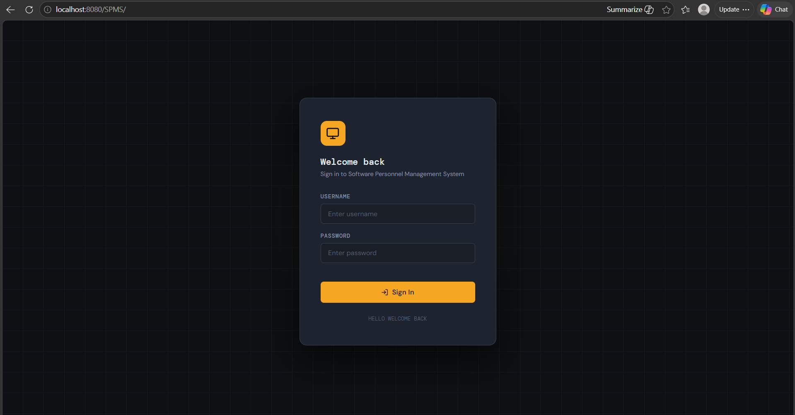
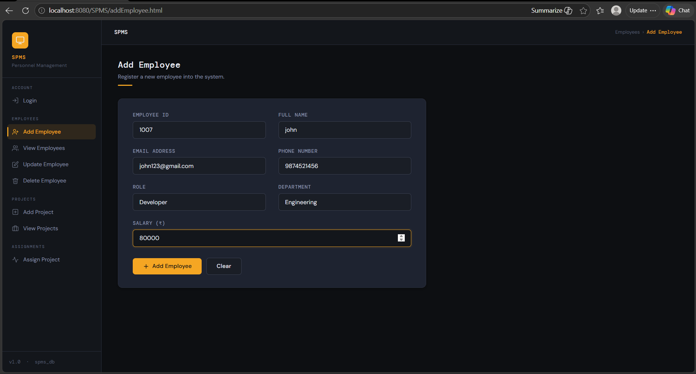
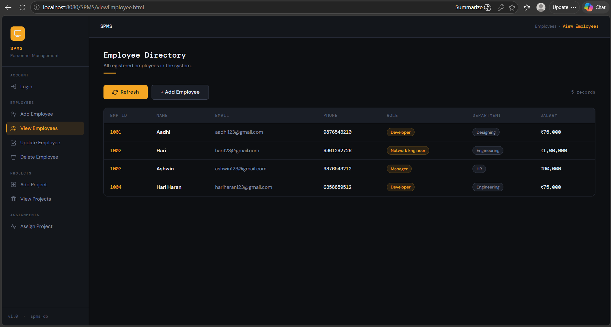
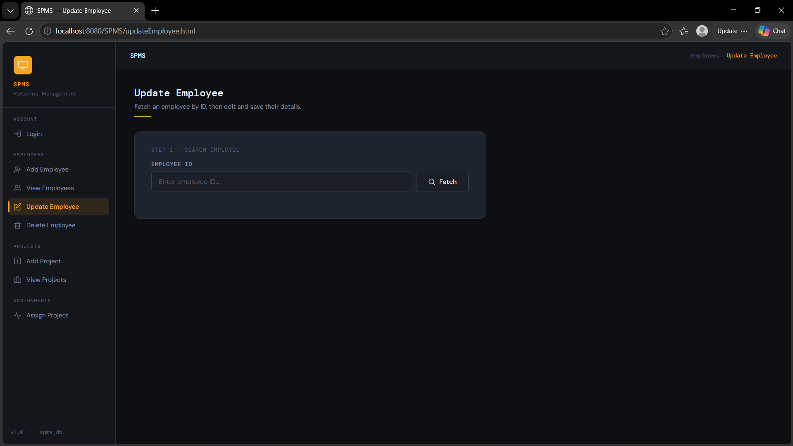
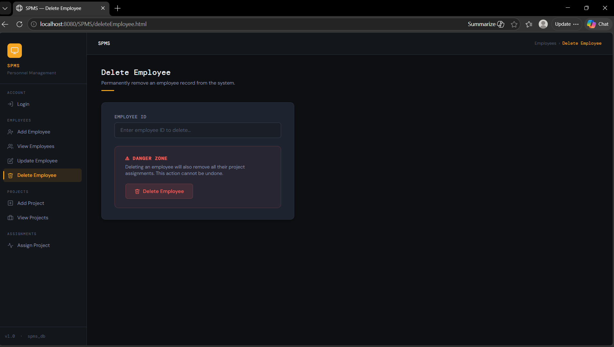
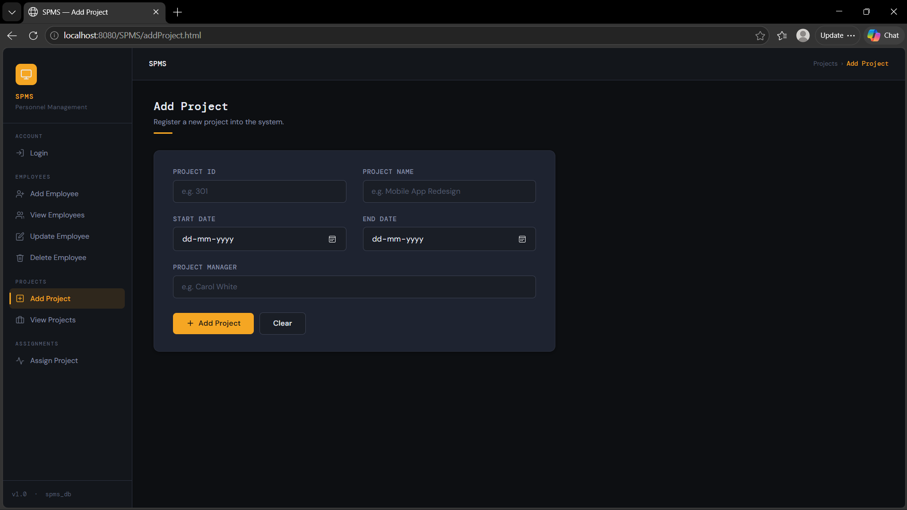
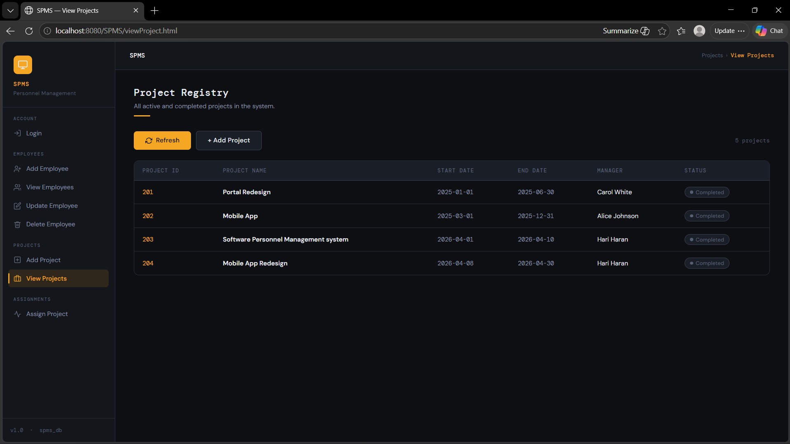
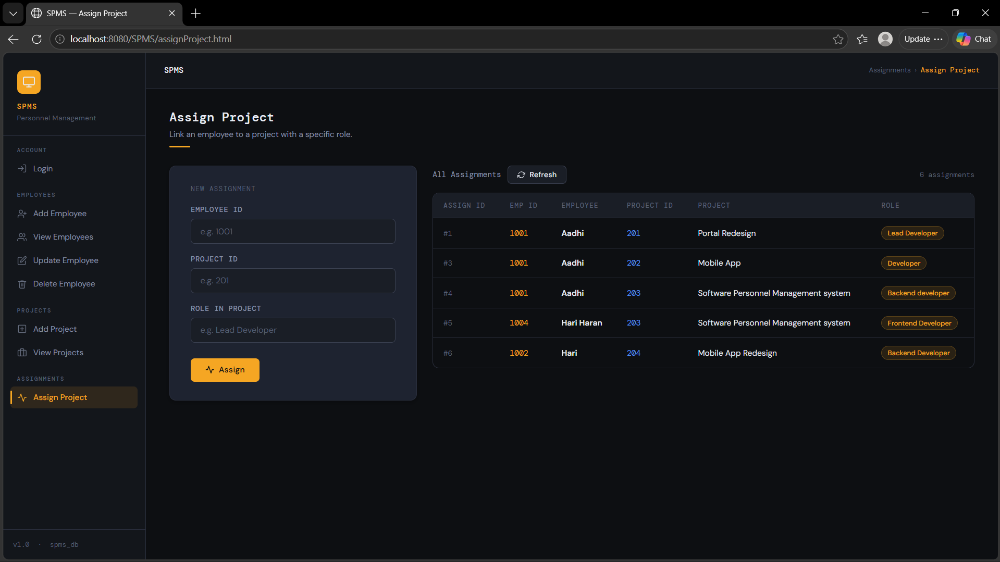

# Software Personnel Management System (SPMS)

## Project Description

Software Personnel Management System (SPMS) is a Java web application developed using Java Servlets, Apache Tomcat, and MySQL. It helps manage employees and projects in an organization.

This project was created to practice Java web development concepts such as Servlets, JDBC, and database connectivity.

---

## Features

- User Login
- Add Employee
- View Employees
- Update Employee
- Delete Employee
- Add Project
- View Projects
- Assign Employees to Projects

---

## Technologies Used

- Java
- Java Servlets
- HTML
- CSS
- JavaScript
- Apache Tomcat
- MySQL
- JDBC
- Maven
- Eclipse IDE

---

## Project Structure

```
SPMS
│
├── src
│   └── main
│       ├── java
│       │   └── com.spms
│       │       ├── servlet
│       │       └── util
│       └── webapp
│           ├── css
│           ├── WEB-INF
│           └── HTML pages
│
├── pom.xml
└── README.md
```

---

## Software Required

- Java JDK 8 or above
- Eclipse IDE
- Apache Tomcat
- MySQL Server

---

## Database Setup

1. Create a MySQL database.

```
spms_db
```

2. Create the required tables.

3. Update the database username and password in

```
DBConnection.java
```

Example:

```java
private static final String URL = "jdbc:mysql://localhost:3306/spms_db";
private static final String USER = "root";
private static final String PASSWORD = "your_password";
```

---

## How to Run

1. Clone or download this project.

2. Open the project in Eclipse.

3. Configure Apache Tomcat.

4. Add the MySQL Connector JAR.

5. Update the database details in `DBConnection.java`.

6. Run the project on the Tomcat server.

7. Open the browser and visit:

```
http://localhost:8080/SPMS/login.html
```

---

## Project Screens

- Login Page
- Employee Management
- Project Management
- Assign Project

(You can add screenshots here later.)

---

## What I Learned

During this project I learned:

- Java Servlets
- JDBC Connectivity
- CRUD Operations
- MySQL Database
- Apache Tomcat Deployment
- Maven Project Structure
- MVC Basics

---

## Future Improvements

- Better UI Design
- Search Employee
- Pagination
- Role-based Login
- Dashboard
- Export Reports

---

## Author

**Kathiravan S**

BE Computer Science and Engineering

```

## Output

```
Software Personnel Management System (SPMS)

Project Description
Features
Technologies Used
Project Structure
Software Required
Database Setup
How to Run
Project Screens
What I Learned
Future Improvements
Author

## Screenshots

### Login Page



### Add Employee



### View Employee



### Update Employee



### Delete Employee



### Add Project



### View Project



### Assign Project

